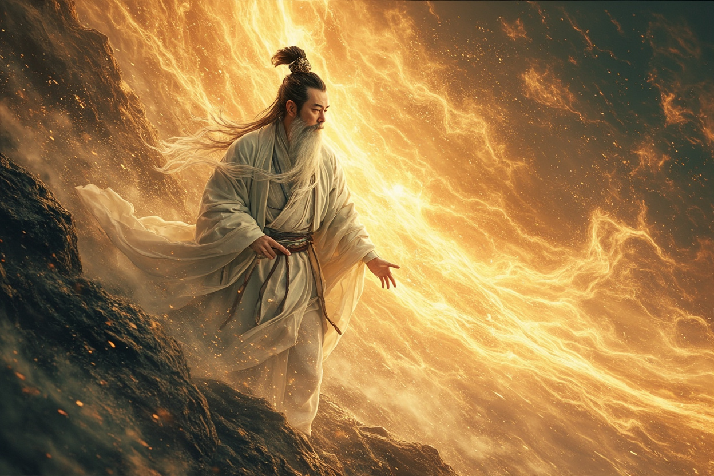

第七章 血脉初现

无尽的深渊之中。

陈墨感觉自己仿佛置身于一片混沌之中，四周一片漆黑，没有上下左右之分，也没有时间空间的概念。

而在这片混沌之中，他隐隐看见了一道身影。

那是一个身穿白衣的中年男子，长发如瀑，周身散发着一股令人心悸的威压。他的面容与陈墨有着七分相似，却又多了几分刚毅与霸气。

“你是……”陈墨试探性地问道。

那白衣男子缓缓转过身来，目光落在陈墨身上，脸上浮现出一抹欣慰的笑容。

“我等了你很久了，孩子。”

他的声音苍老而温和，带着一股难以言说的亲近感。

“我是你父亲的祖上，陈玄。”

陈墨浑身一震！

陈玄！？那不就是仙族的开创者吗！？那不就是他体内血脉的源头吗！？

“前……前辈……”陈墨一时之间不知该说什么。

陈玄微微一笑：“不必紧张。我只是一缕留存在传承之中的意识，并非本体。”

“这道传承，是我当年飞升之时留下的。本是为了传承陈家的血脉，但却阴差阳错地被你们青云宗的开宗祖师所得。”

“多年以来，我一直在此沉睡，等待着有资格接受传承的陈家后人出现。”

“而今日——”他的目光变得深邃，“你终于来了。”

陈墨的心跳加速了几分。他没想到，这处传承竟然与自己的先祖陈玄有关！

“孩子，你体内流淌着我留下的血脉。”陈玄缓缓说道，“这股血脉之中，封印着混沌圣体的力量。”

“混沌圣体，乃是远古时期最强大的体质之一，能容纳天地万法，驾驭阴阳五行。若是觉醒，你的修炼速度将远超常人，而且同阶之内，几乎无敌。”

“但是——”他的语气忽然变得凝重，“这股力量太过强大，若是在你实力不足之时觉醒，将会引来天道的注意，甚至可能招致天罚。”

“所以，我在你的血脉之中设下了封印。在你足够强大之前，这股力量不会完全觉醒。”

陈墨想起了这些日子以来体内那股蠢蠢欲动的力量，心中顿时恍然。

原来如此。

“那前辈留下这道传承，是要我……”

“我要传你三样东西。”陈玄说道，“其一，我毕生所学的功法——混沌真解；其二，我的一些战斗经验与神通秘法；其三——”

他顿了顿，目光中闪过一丝追忆：“其三，是一段真相。”

“真相？”

“关于我当年叛出仙族的真相。”

陈墨屏住了呼吸。

“当年，我以混沌圣体开创仙族，被后世尊为始祖。然而，我的力量太过强大，威胁到了仙族高层的利益。”

“他们设计陷害于我，想要将我的血脉剥夺，用来培养新的傀儡。”

“我知道，若是我的后代继续留在仙族，早晚会落入他们之手。所以，我选择了叛出仙族，隐瞒身份，在人间传承血脉。”

“你的父亲，是我选中的传承者。可惜，他最终还是暴露了身份，被迫以身殉道。”

说到这里，陈玄的眼中闪过一丝悲伤。

“如今，这份责任，落在了你的肩上。”

陈墨沉默了很久。

他终于明白了一切。原来，父亲的死，并不是因为遇到了妖兽，而是被仙族追杀！原来，他体内的血脉，从一开始就是被仙族所不容的！

“前辈，我该怎么做？”他问道。

“变强。”陈玄说道，“只有足够强大，你才能保护自己，保护你所珍视的人。”

“现在，接受我的传承吧。”

话音刚落，一股磅礴的信息便涌入了陈墨的识海之中！

那信息浩如烟海，包罗万象——有功法、有秘术、有经验、有感悟……陈墨只感觉自己的脑海中仿佛炸开了一般，无数的知识与画面如同走马灯般在他眼前闪过。

也不知过了多久，那股信息终于停止了涌入。

陈墨缓缓睁开眼睛，发现自己仍然站在那片荒凉的戈壁滩之上。

现实之中，似乎只过去了片刻。

“你醒了？”一个冰冷的声音从身旁传来。

陈墨转头看去，只见林清雪正站在他身旁，一脸警惕地看着四周。

“林师姐？”陈墨愣了一下，“你怎么在这里？”

“方才你通过心境考验之后，触发了某种禁制，整个人都被一道金光包裹。”林清雪说道，“我是第一个发现异常的人，所以便守在了你身旁。”

“其他人呢？”

“都在各自的考验之中。”林清雪看了他一眼，“你的运气不错，心境考验竟然这么快就通过了。”

她的目光中闪过一丝探究，似乎想问什么，但最终只是说道：“第二关：战力考验，即将开始。你准备好了吗？”

陈墨点了点头：“准备好了。”

他抬起手来，只见掌心之中多了一道淡淡的符文。那是方才传承之时，陈玄留在他身上的印记，象征著传承者的身份。

不仅如此，他的修为也在方才的传承之中获得了巨大的提升！

原本他只是炼气七层，而如今，他的修为已经突破了瓶颈，一举达到了炼气九层！

不仅如此，他还获得了陈玄传授的一门新功法——混沌真解，以及数种强大的神通秘法！

这些收获，让他的实力有了质的飞跃！

“第二关：战力考验，现在开始！”

那虚无缥缈的声音再次在空中响起。

下一刻，陈墨眼前的景象再次变幻——

他出现在了一个巨大的竞技场之中。竞技场四周是高耸的石墙，石墙之上刻满了古老的符文，散发着淡淡的荧光。

而在竞技场的中央，一尊三丈高的巨大石像正在缓缓苏醒！

那石像浑身漆黑，散发着一股令人心悸的恐怖气息。它的眼眸之中，燃烧着两团幽绿的火焰，如同深渊中的恶魔，正在审视着它的猎物。

“炼气巅峰的傀儡？”陈墨眉头微皱。

根据他所获得的传承知识，眼前这尊石像，乃是上古时期的一种强大傀儡，名为“玄甲石人”。它的实力相当于炼气巅峰的人类修士，而且防御力极为惊人，普通攻击几乎无法伤它分毫。

“哈哈，让我看看这个天才有多少本事！”竞技场外，韩成正躲在一处隐蔽的地方，脸上露出一抹阴狠的笑容。

他没有通过心境考验，被淘汰出局，但他却利用关系，在外面观看其他人的表现。

此刻，看到陈墨即将对战如此强大的傀儡，他的心中顿时充满了期待——

最好让那傀儡把陈墨打死！

然而，让他失望的事情发生了。

只见陈墨缓缓抬起手来，掌心之中凝聚出一道淡淡的金色光芒。那光芒虽然微弱，却散发着一股令人心悸的威压！

“破！”

陈墨轻轻向前一拍，那道金色光芒便如同流星一般，朝着玄甲石人飞射而去！

下一刻，那道光芒直接洞穿了玄甲石人的胸口，在其胸膛之上留下一个巨大的空洞！

玄甲石人的眼眸中的火焰瞬间熄灭，身体轰然倒地，再也无法动弹。

一掌毙命！

竞技场外，韩成的眼珠子都快瞪出来了。

“这……这怎么可能！？”他的声音都在发抖，“他明明只是炼气境界，怎么可能一掌就打败了炼气巅峰的傀儡！？”

林清雪的眼中也闪过一丝震惊之色。

她自问自己的实力也能打败这尊傀儡，但绝不可能如此轻松。而陈墨方才那一掌的威力，似乎还远远不是他的全部实力……

这个山村少年，究竟隐藏了多少实力？

“第二关，通过！”那虚无缥缈的声音再次响起。

接下来的试炼，便轻松了许多。

在第三关的悟性挑战之中，陈墨更是展现出了惊人的天赋。那位远古大能留下的道韵，他仅用了半个时辰便全部悟透，速度之快，简直匪夷所思。

三日之后，试炼结束。

陈墨以第一名的成绩通过了全部考验，获得了那位远古大能的完整传承。

而他的修为，也从炼气七层，一跃突破到了炼气巅峰！

距离筑基，只有一步之遥！

试炼结束后，宗门长老们亲自为通过试炼的弟子们举行了表彰仪式。

宗主青云子站在高台之上，目光在弟子们身上一一扫过，最终落在了陈墨身上。

“陈墨。”他的声音在大殿中回荡，“你在这次试炼中的表现，十分出色。”

“经过长老们商议，决定授予你——核心弟子第一位！”

此言一出，大殿之上顿时响起一片哗然！

核心弟子第一位！那可是核心弟子中的最高地位！不仅意味着更多的修炼资源，更意味着整个宗门的瞩目！

“多谢宗主！”陈墨拱手行礼，神色平静。

他对这些虚名并不在意，他在意的是自己能否变得更加强大。

然而，并非所有人都为他感到高兴。

韩成站在人群之中，死死地盯着陈墨，眼中充满了怨毒的光芒。

他不仅没有通过试炼，而且在试炼之中，他还暗中做了手脚，想要借傀儡之手除掉陈墨，却没想到陈墨的实力竟然如此强大，他的一切算计都化为了泡影。

“陈墨……你等著……”他低声说道，声音中充满了阴狠，“我不会就这样算了的……”

而在人群的角落，一个身穿黑衣的身影也悄然注视着这一切。

那人看起来与普通弟子没有什么两样，但若有人细看，便会发现他的气息深沉得可怕，远非普通弟子所能比拟。

“混沌圣体……果然觉醒了……”他低声自语，声音中充满了诡异的笑容，“看来，是时候通知上面的人了……”

当晚，陈墨回到自己的小院，开始整理这段时间以来的收获。

首先是混沌真解功法——这门功法是陈玄传授给他的核心功法，修炼到极致，可以操控混沌之力，破灭万物。

其次是几种神通秘法——包括一道名为“混沌指的”一指神通，以及一道名为“天地变”的辅助秘法。

最后是一段记忆——那是关于他父亲陈远的记忆。

通过这段记忆，陈墨终于知道了父亲当年的完整经历。

原来，父亲当年并不是被迫逃亡，而是在得知仙族的阴谋之后，主动离开仙族，来到人间隐姓埋名。他遇到陈墨的母亲之后，本以为可以就此平淡地度过一生，却没想到仙族的追兵还是找到了他。最终，他选择了牺牲自己，保护年幼的陈墨。

看着这段记忆，陈墨的眼眶顿时湿润了。

“父亲……我一定不会辜负您的牺牲。”他在心中默默说道。

就在这时，他的耳朵忽然微微一动。

有人在靠近！

而且，不止一个！

陈墨霍然站起身来，目光朝院墙的方向看去。只见三道黑影正从三个方向朝他的小院逼近，动作悄无声息，显然是训练有素的杀手。

“出来吧。”陈墨的声音平淡，但却清晰地传入了三人的耳中，“藏头露尾的，算什么好汉？”

三道黑影微微一怔，似乎没想到陈墨竟然能发现他们。不过，既然被发现了，他们也不再隐藏身形。

只见三个身穿黑衣、面戴黑巾的男子落在了小院之中，将陈墨团团包围。

“核心弟子第一位，陈墨？”为首的黑衣人阴测测地笑道，“果然有些本事，怪不得能在传承试炼中表现得那么出色。”

“你们是谁？”陈墨问道。

“死人不需要知道这些。”为首黑衣人冷哼一声，“动手！”

三道黑影同时暴起，各自朝陈墨发起了进攻！

他们的实力，赫然都是筑基境界！

三个筑基修士，对付一个炼气巅峰的修士，在他们看来，简直是手到擒来！

然而，让他们做梦也没想到的是——

陈墨只是轻轻抬起手来，掌心之中凝聚出一道璀璨的金色光芒。

“混沌指。”

他轻轻向前一点。

下一刻，一道金色的光柱从他指尖暴射而出，如同天罚降临，直接洞穿了为首黑衣人的胸口！

为首黑衣人甚至来不及发出惨叫，便直接毙命！

剩下两个黑衣人大惊失色，转身就要逃走。

“想走？”

陈墨冷哼一声，抬手又是两指，两道金光暴射而出，直接将他们二人也当场格杀！

三个筑基境界的杀手，就这样被一个炼气境界的少年，在电光火石之间，全部解决！

而就在这时，陈墨胸口传来一阵灼热。

古玉之中，那道声音再次响起——

“做得好，孩子……”

“但这只是开始……”

“那些人背后的势力，不会就此罢休……”

“你必须变得更加强大，才能保护自己……”

陈墨低下了头，望着手中仍在微微散发着金光的古玉，眼中闪过一丝复杂的光芒。

是的，这只是开始。

前方还有更多的挑战在等着他。

但他，已经准备好了。

