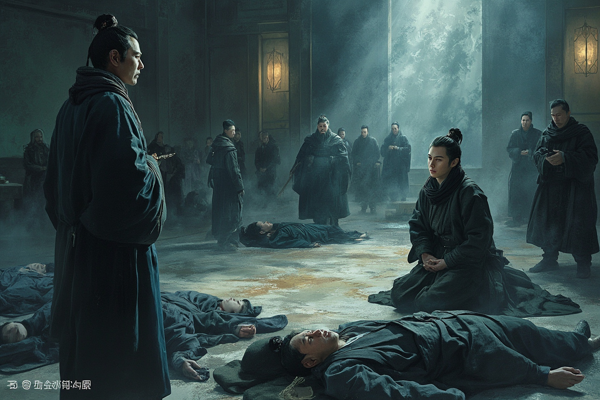

第八章 内门争斗

翌日清晨。

青云宗执法堂内，气氛异常凝重。

三名黑衣人的尸体整整齐齐地摆放在大堂之上，周围站着数位神色严肃的执法弟子。

陈墨站在堂中，神色平静地将昨夜发生的事情叙述了一遍。

“你是说，你一人独自击杀了三名筑基境界的杀手？”执法堂长老皱着眉头，目光中充满了怀疑。

他名叫赵无极，是宗门的执法长老，修为已达元婴境界，在宗门中地位极高。

“是的。”陈墨点了点头。

“可笑！”一个不和谐的声音从一旁响起。只见韩成不知何时也来到了执法堂，一脸阴阳怪气地说道，“陈师弟不过是炼气境界的修为，如何能击杀三名筑基境界的高手？我看，分明是有人故意夸大其词！”

他昨夜在得知那三名杀手失手被杀之后，便立刻意识到机会来了。

三名杀手，虽然是他暗中安排的人，但他并未亲自动手，而且行事极为隐秘，没有人能查到他头上。但这并不妨碍他借此机会打击陈墨。

一个炼气境界的弟子，却能击杀三名筑基高手？这种事情，说出去谁信？

“陈师弟的资质固然不凡，但修炼时间摆在那里，区区半个月，如何能与三名筑基高手抗衡？”他皮笑肉不笑地说道，“我倒是觉得，事情另有蹊跷。”

“说不定，那三名杀手根本不是死于陈师弟之手，而是另有其人。或者……”他的眼中闪过一丝阴狠，“陈师弟与那些杀手根本就是一伙的！”

此言一出，大堂之上顿时响起一片议论声。

“韩成，你血口喷人！”林枫忍不住站了出来，“昨夜之事，我亲眼所见！三名杀手确实是陈师弟所杀，而且整个过程干净利落，没有一丝拖泥带水！”

“哦？林师兄亲眼所见？”韩成冷笑道，“那你倒是说说，你是何时到的？又是如何看到整个过程的？”

林枫一时语塞。他其实是在战斗结束之后才赶到的，并未亲眼目睹战斗的经过。

“我……”

“林师兄不必为我辩解。”陈墨打断了他的话，目光平静地看向韩成，“韩师兄既然对我的实力有所怀疑，那不如这样——你我上比武台切磋一场，真假虚实，一试便知。”

此言一出，全场皆惊！

谁都没想到，陈墨竟然会主动向韩成下战书！

韩成的脸色顿时变得难看无比。他的修为已经达到了筑基中期，比那三名杀手中的任何一人都要强大。而陈墨虽然能击杀三名筑基，但那是乘其不备、各个击破的效果，若是真的正面交锋，他未必没有胜算……

“挑战？你区区一个新晋弟子，也有资格挑战我？”他冷哼一声，试图用言语挤兑陈墨，“再说了，我与那三名杀手毫无关系，你向我挑战，简直莫名其妙！”

“你有没有关系，上比武台一试便知。”陈墨的语气平淡，但却透著一股不容拒绝的霸气，“当然，若是你不敢，我也不强求。只希望日后，韩师兄不要再在暗地里搞这些见不得人的勾当。”

“你——！”韩成的脸色顿时胀得通红，一时之间却找不到反驳的话语。

“好了，够了！”

赵无极长老沉声喝道，制止了两人的争执。

“此事，我会让人彻查。那三名杀手的身份，以及幕后主使，迟早会有结果。”

“在此之前，陈墨所言，我暂且相信。但若日后查出任何问题……”他的目光如刀，在陈墨身上停留了片刻，“休怪我不客气。”

“弟子明白。”陈墨拱手行礼，神色平静。

此事暂时告一段落，但陈墨知道，这并不是结束，而是开始。

韩成背后的势力，以及那三名杀手的幕后主使，都还没有浮出水面。

而且，经过这一次的事情，他与韩成之间的恩怨，算是彻底结下了。

从执法堂出来之后，林清雪忽然出现在了陈墨身旁。

“你方才的表现，有些冲动了。”她的语气仍是那么冷淡，但其中似乎多了一丝难以察觉的关切。

“冲动？”陈墨微微一愣。

“你不该当众向韩成下战书。”林清雪说道，“此人虽然心胸狭隘，但他的背后，站着宗门的孙长老。孙长老在宗门中势力很大，与他结怨，对你没有好处。”

“而且——”她看了陈墨一眼，“你暴露了太多。击杀三名筑基杀手的事情，很快便会传遍整个宗门。到时候，所有人都会对你刮目相看，同时也会对你心生忌惮。”

“木秀于林，风必摧之。你应该明白这个道理。”

陈墨沉默了片刻，说道：“多谢林师姐提醒。”

“不过——”他抬起头来，目光中闪烁著一股难以言说的坚定，“有些事情，就算知道会招来麻烦，也必须去做。”

“我不会因为害怕麻烦，便对那些暗中陷害我的人视而不见。”

林清雪看着他，眼中闪过一丝异样的光芒。

“你和别人……果然不太一样。”她轻声说道，语气中似乎多了几分认可。

两人沉默片刻，她忽然再次开口：“我告诉你一件事。”

“什么事？”

“关于你父亲的事。”林清雪的目光变得深邃，“我曾经在宗门的典籍中，看到过一些记载。十八年前，确实有一位名为“陈远”的年轻修士来过青云宗。据记载，他是当时仙族中的一位叛逃者，修为通天，来去如风。”

“他来青云宗的时间很短，只有区区三日。但在这三日之内，他与当时的宗主——也就是现任宗主青云子的师尊，进行了一次长谈。”

“那次长谈的内容，没有人知道。但从那之后，青云宗便开始暗中保护清溪村。”

陈墨浑身一震！

原来，清溪村这些年来之所以能平安无事，是因为青云宗在暗中保护！

而这一切，都是因为父亲！

“为什么……师姐会知道这些？”他问道。

林清雪沉默了片刻，说道：“因为我的师尊，也与那段历史有着千丝万缕的联系。”

她的师尊，便是青云宗的宗主青云子。也就是说，宗主与陈墨的父亲之间，似乎有着某种不为人知的渊源？

“这件事，你自己心中有数便好。”林清雪说道，“我告诉你这些，是希望你能明白——在宗门之内，你并不是孤身一人。”

“有些人想要对付你，但也有一些人，站在你这边。”

说完，她便转身离去，白衣飘飘，很快便消失在了晨曦之中。

陈墨站在原地，看着她远去的背影，心中思绪万千。

她为什么要告诉他这些？她又是从哪里得知这些消息的？

太多的疑问，萦绕在他心头。

不过，有一点他可以确定——林清雪对他，并无恶意。

下午时分，陈墨来到了宗门的藏经阁。

他想要查找一些关于筑基境界的资料，为日后突破做准备。

然而，让他没想到的是，他在藏经阁中，意外地发现了一本被封禁的古籍。

那古籍外表破旧，封面上写着四个已经褪色的大字——《仙族秘史》。

陈墨心头一动，伸手便要拿起那本古籍。

“那是禁书。”一个苍老的声音从他身后传来，“外门弟子以上，才有资格阅读。但即便如此，也不建议你看。”

陈墨转过身去，只见一个白发苍苍的老者正站在书架旁边，正一脸威严地看着他。

那老者看起来平平无奇，仿佛只是一个普通的老门房。但陈墨却隐隐感觉到，这老者的气息深不可测，远非普通修士所能比拟。

“前辈是……”

“老朽只是藏经阁的一个看门人罢了。”老者微微一笑，“不过，既然小友对仙族之事感兴趣，老朽倒是可以告诉你一些事情。”

“什么事情？”

“关于仙族的一些……不为人知的秘闻。”老者的目光深邃，似乎能看穿人心，“比如——当年陈玄叛出仙族的真正原因。”

陈墨的心跳顿时加速了几分。

“据说，陈玄当年叛出仙族，并不只是因为受到了陷害。”老者缓缓说道，“更重要的是，他发现了一个惊天的秘密。”

“一个关于六界存亡的秘密。”

“这个秘密的具体内容，老朽也不清楚。但据说，一旦这个秘密被揭开，将会动摇整个六界的根基。”

“所以，仙族才会不惜一切代价，追杀陈玄的后代。”

陈墨的瞳孔猛地收缩。

动摇六界根基的秘密？这究竟是什么秘密？

“前辈……”

“好了，老朽说的已经够多了。”老者打断了他的话，“有些事情，需要你自己去探索。老朽只能告诉你一点——”

“小心仙族。”

“那些高高在上的仙族，并不像表面上看起来那么光鲜。他们的双手，沾满了鲜血。”

说完，老者便飘然而去，仿佛从未出现过一般。

陈墨站在原地，久久无法平静。

今日的种种经历，让他对这个世界有了更加深刻的认识。

原来，他所面对的敌人，不仅仅是韩成这样的小人，更是整个仙族！

而他父亲当年之所以叛出仙族，也不仅仅是为了保护自己的血脉，更是为了一个惊天的秘密……

夜幕降临，陈墨回到小院，却发现门口站着一个熟悉的身影。

是林枫。

“陈师弟，你终于回来了！”林枫一脸焦急地说道，“出大事了！”

“什么事？”

“内门首席弟子赵天骄，向你下战书了！”

陈墨眉头一皱：“赵天骄？”

“不错！他是宗门内门弟子中的第一人，修为已经达到了筑基巅峰，距离金丹只有一步之遥！”林枫的脸上充满了担忧，“他在挑战书上说，你一个新晋弟子，竟然在传承试炼中表现得那么出色，他很不服气。所以，他要在三日后的比武台上，与你切磋一番！”

“切磋？”陈墨冷冷一笑，“恐怕不只是切磋那么简单吧。”

“你说得对。”林枫叹了口气，“我听说，赵天骄与韩成交情匪浅。你今日在执法堂当众羞辱了韩成，他肯定是咽不下这口气，所以找来了赵天骄替他出头！”

陈墨沉默了片刻，说道：“三日后的比武，我接了。”

“陈师弟！”林枫大惊，“你千万不要冲动！赵天骄的实力可不是开玩笑的！他是筑基巅峰，而你只是炼气巅峰，双方差了整整一个大境界！你若应战，必输无疑！”

“不见得。”陈墨的眼中闪过一丝精光，“有些事情，躲是躲不掉的。既然他们想要踩着我上位，那我便让他们知道，踢到铁板是什么滋味。”

“可是……”

“林师兄不必担心。”陈墨拍了拍他的肩膀，“我自有分寸。”

他转过身去，望向夜空中的星辰，眼中闪烁著一股炽热的光芒。

三日后的比武，不仅是他向宗门展示实力的机会，更是他在这个弱肉强食的世界立足的第一步。

他必须赢。

不仅要赢，还要赢得漂亮！

而在远处的某处洞府之中，一个身穿金袍的年轻男子正端坐在蒲团之上，周身气息深沉如渊。

他便是内门首席弟子——赵天骄。

“陈墨……”他缓缓睁开眼睛，嘴角勾起一抹不屑的笑容，“一个区区炼气境界的蝼蚁，竟然敢在宗门之内如此张狂。三日后，我倒要看看，你究竟有多少本事！”

他的身旁，韩成正一脸恭敬地站着，眼中充满了期待。

“师兄，这一次，可就拜托您了！”

“放心。”赵天骄淡淡地说道，“一个小小的山村孤儿，我还不放在眼里。三日之后，他便会知道，什么叫天高地厚！”

夜风呼啸，吹动了洞府的帷幔。

而在这看似平静的夜晚，无数的暗流正在涌动。

三日后的世纪大战，即将拉开帷幕！

